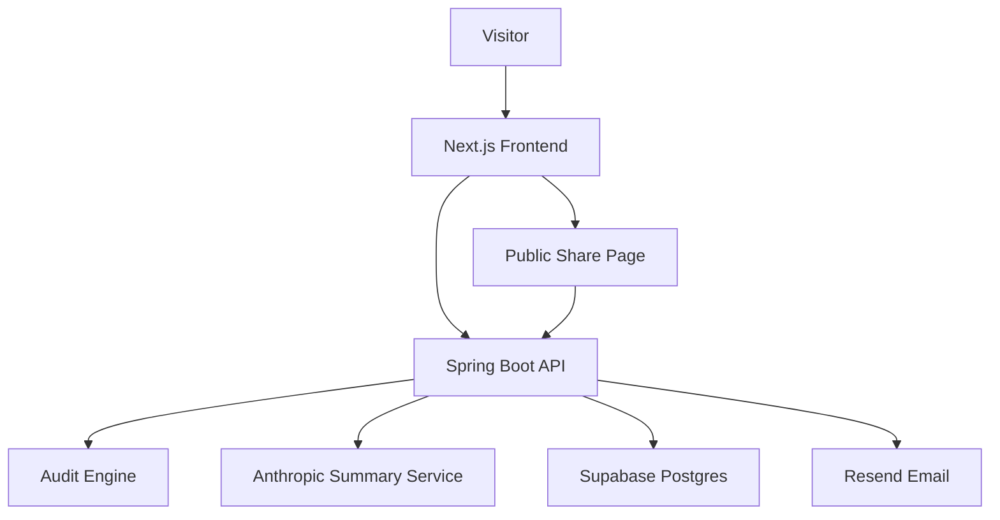

# Architecture

## Data flow
1. User enters AI tool spend.
2. Frontend sends request to `POST /api/audits`.
3. Backend calculates savings using deterministic rules.
4. Backend calls Anthropic for a summary.
5. If Anthropic fails, fallback summary is used.
6. Audit is saved in Supabase with a public slug.
7. Lead capture is saved separately using `POST /api/leads`.
8. Public URL uses `GET /api/audits/public/{slug}` and never returns email/company details.

## Why this stack
Spring Boot keeps business logic, Supabase writes, AI API calls, and email sending secure. Supabase gives a real Postgres database with a simple REST API. Next.js is used for polished UI and dynamic Open Graph metadata.

## If handling 10k audits/day
I would add Redis rate limiting, queue email sending, cache public audit reads, move pricing rules into versioned config, and add structured logs.
