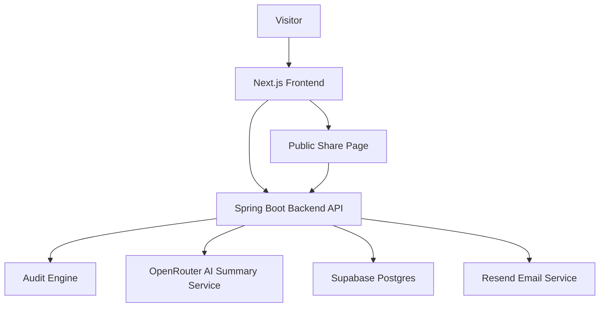

# Architecture

## System overview

The frontend handles:

* spend input
* results rendering
* lead capture
* public share pages

The backend handles:

* pricing logic
* AI summaries
* Supabase writes
* email sending
* public audit retrieval

## Audit flow

1. User submits AI stack.
2. Frontend calls `POST /api/audits`.
3. Backend calculates deterministic savings.
4. OpenRouter generates summary.
5. If AI fails, fallback summary is used.
6. Audit is stored with a public slug.
7. Public page renders from slug.

## Abuse protection

The lead form uses a honeypot field called `website`.

Bots usually fill every field automatically. If `website` is not empty, the backend rejects the request.

This was chosen because it adds no friction for normal users.
